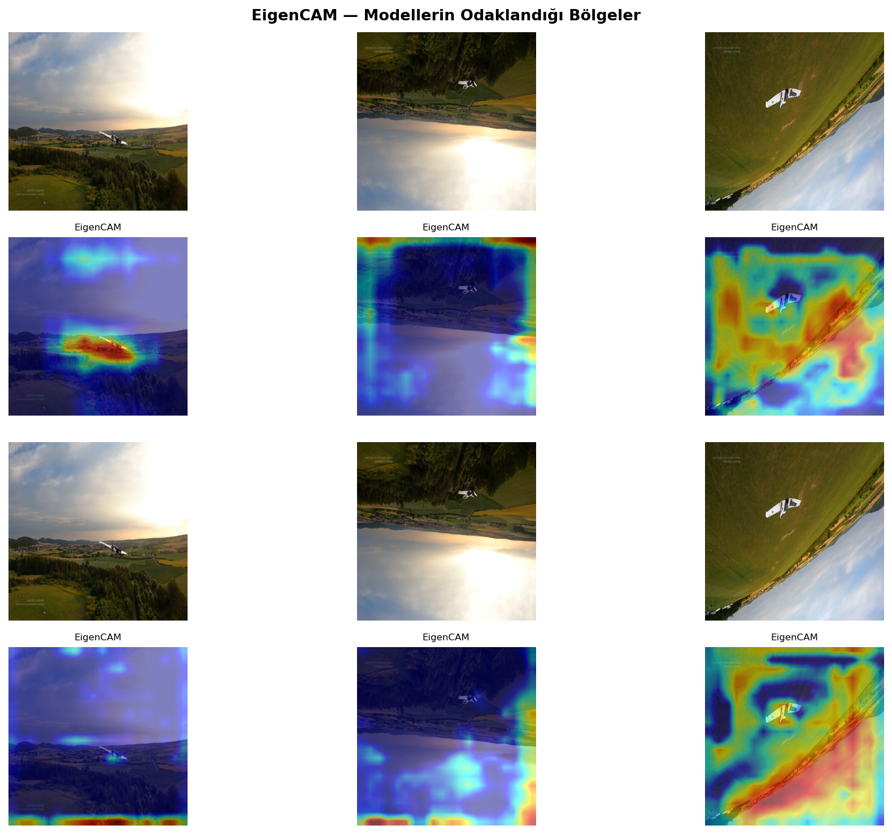
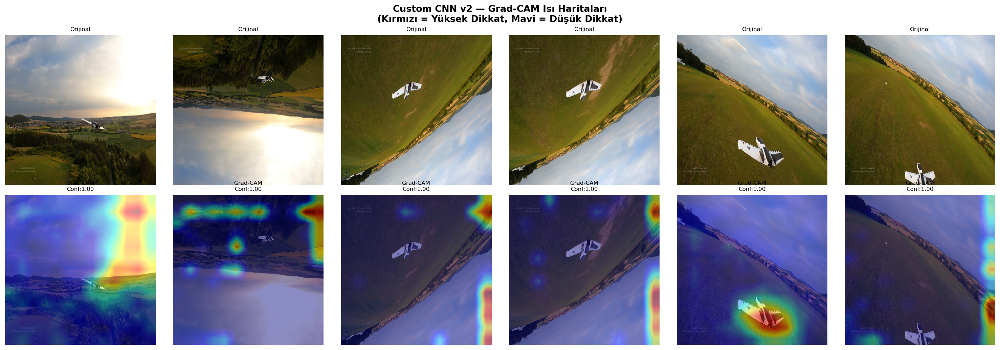

# 🛩️ Fixed-Wing Drone Detection using Deep Learning

> Comparative analysis of 4 deep learning models for fixed-wing UAV detection in aerial imagery.


---

## 📋 Project Overview

This project trains and compares **4 deep learning object detection models** on a fixed-wing drone dataset:

| Model | Type | Parameters | mAP@50 (Test) | Inference |
|-------|------|-----------|--------------|-----------|
| Custom CNN | Sıfırdan / Scratch | ~18M | — | — |
| YOLOv8n | Transfer Learning | ~2.7M | 0.925 | 5.5ms |
| YOLO11n | Transfer Learning | ~2.6M | 0.934 | 6.6ms |
| **YOLO11s** | Transfer Learning | ~9.4M | **0.940** | 9.0ms |

### 🎯 Key Results
- **Best accuracy**: YOLO11s (mAP50 = 0.940)
- **Best for Jetson Orin Nano**: YOLO11n (6.6ms, mAP50 = 0.934)
- **YOLO11 vs YOLOv8**: YOLO11n outperforms YOLOv8n by ~1% mAP with similar parameters

---

## 📁 Repository Structure

```
fixed-wing-drone-detection/
│
├── models/
│   ├── YOLO11n/
│   │   ├── best.pt              # Trained weights
│   │   └── plots/               # Training curves, confusion matrix, PR curve...
│   ├── YOLO11s/
│   │   ├── best.pt
│   │   └── plots/
│   ├── YOLOv8n/
│   │   ├── best.pt
│   │   └── plots/
│   └── CustomCNN/
│       ├── best.pt
│       └── plots/
│
├── plots/                        # XAI visualizations & comparison charts
│   ├── custom_cnn_v2_gradcam.png
│   ├── eigencam_yolo.png
│   ├── speed_vs_accuracy.png
│   └── ...
│
├── train_detection.py            # Main training script (all 4 models)
├── retrain_custom_cnn.py         # Custom CNN training script
├── evaluate_custom_cnn.py        # Custom CNN evaluation
├── eigen_cam.py                  # EigenCAM XAI visualization
├── yolo_gradcam.py               # YOLO Grad-CAM visualization
├── drone_detection_final_report.docx  # Full project report (Turkish)
└── fixed_wing_dataset/data.yaml  # Dataset config
```

---

## 🗂️ Dataset

**Fixed-Wing Drone Detection Dataset** by Alihanozturk (Kaggle, 2023)

- **Train**: 5,003 images
- **Val**: 1,007 images  
- **Test**: 431 images (30% split from val)
- **Class**: `fixed_wing_drone` (1 class)
- **Format**: YOLO txt annotations

### Download Dataset
```bash
pip install kaggle
kaggle datasets download -d alihanozturk/fixed-wing-drone-detection-dataset -p . --unzip
```

---

## ⚙️ Installation

```bash
# Clone the repository
git clone https://github.com/A-G-J/fixed-wing-drone-detection.git
cd fixed-wing-drone-detection

# Install dependencies
pip install ultralytics torch torchvision opencv-python matplotlib scikit-learn seaborn tqdm grad-cam
```

---

## 🚀 Usage

### Run inference on an image
```python
from ultralytics import YOLO

# Load model
model = YOLO('models/YOLO11n/best.pt')

# Run on image
results = model('your_image.jpg', show=True, conf=0.3)
```

### Run inference on a video
```python
from ultralytics import YOLO

model = YOLO('models/YOLO11n/best.pt')
model(source='your_video.mp4', show=True, conf=0.3)
```

### Run inference on webcam
```python
from ultralytics import YOLO

model = YOLO('models/YOLO11n/best.pt')
model(source=0, show=True, conf=0.3)  # 0 = default webcam
```

### Run inference on all models and compare
```python
from ultralytics import YOLO

models = {
    'YOLOv8n':  'models/YOLOv8n/best.pt',
    'YOLO11n':  'models/YOLO11n/best.pt',
    'YOLO11s':  'models/YOLO11s/best.pt',
}

for name, path in models.items():
    model = YOLO(path)
    results = model('your_image.jpg', conf=0.3)
    print(f'{name}: {len(results[0].boxes)} detections')
```

### Evaluate on test set
```python
from ultralytics import YOLO

model = YOLO('models/YOLO11s/best.pt')
metrics = model.val(data='fixed_wing_dataset/data.yaml', split='test')

print(f'mAP50    : {metrics.box.map50:.4f}')
print(f'mAP50-95 : {metrics.box.map:.4f}')
print(f'Precision: {metrics.box.mp:.4f}')
print(f'Recall   : {metrics.box.mr:.4f}')
```

---

## 🏋️ Training

### Train all models from scratch
```bash
python train_detection.py
```

### Train Custom CNN only
```bash
python retrain_custom_cnn.py
```

### Train a specific YOLO model
```python
from ultralytics import YOLO

model = YOLO('yolo11n.pt')  # or yolo11s.pt, yolov8n.pt
model.train(
    data='fixed_wing_dataset/data.yaml',
    epochs=50,
    imgsz=640,
    batch=16,
    device=0,
    name='YOLO11n',
)
```

---

## 🔍 XAI - Explainable AI

### Generate EigenCAM for YOLO models
```bash
python eigen_cam.py
```

### Generate Grad-CAM for Custom CNN
```bash
python evaluate_custom_cnn.py
```

### Output plots location
```
plots/
├── custom_cnn_v2_gradcam.png     # Grad-CAM heatmaps
├── eigencam_yolo.png             # EigenCAM for YOLO11n & YOLO11s
└── speed_vs_accuracy.png         # Speed vs Accuracy chart
```

---

## 📊 Results

### Speed vs Accuracy Tradeoff


### EigenCAM - Where the model looks


### Custom CNN Grad-CAM


---

## 🤖 Deployment on Jetson Orin Nano

**Recommended model: YOLO11n** (6.6ms inference, mAP50=0.934)

```bash
# Export to TensorRT for Jetson
from ultralytics import YOLO

model = YOLO('models/YOLO11n/best.pt')
model.export(format='engine', device=0)  # Exports to YOLO11n.engine

# Run with TensorRT
model = YOLO('YOLO11n.engine')
model(source=0, show=True)  # Real-time on camera
```

---

## 📈 Training Details

| Parameter | Custom CNN | YOLOv8n | YOLO11n | YOLO11s |
|-----------|-----------|---------|---------|---------|
| Image Size | 416×416 | 640×640 | 640×640 | 640×640 |
| Batch Size | 8 | 16 | 16 | 16 |
| Epochs | 16 | 50 | 50 | 50 |
| Optimizer | AdamW | AdamW | AdamW | AdamW |
| LR | 1e-4 | 1e-3 | 1e-3 | 1e-3 |
| Training Time | ~93 min (CPU) | ~70 min | ~44 min | ~23 min |
| GPU | RTX 3050 | RTX 4090 | RTX 4090 | RTX 4090 |

---

## 📦 Data Augmentation

| Technique | Parameter | Purpose |
|-----------|-----------|---------|
| RandomCrop | 640→672, crop 640 | Position diversity |
| RandomHorizontalFlip | p=0.5 | Direction invariance |
| RandomRotation | ±30° | Angle diversity |
| ColorJitter | brightness=0.3 | Lighting robustness |
| GaussianBlur | σ=(0.1, 2.0) | Blur tolerance |
| RandomErasing | p=0.2 | Occlusion simulation |
| Mosaic (YOLO) | 4-image mosaic | Small object detection |

---

## 📚 References

- [Ultralytics YOLO11](https://docs.ultralytics.com/models/yolo11/)
- [Fixed-Wing Drone Detection Dataset](https://www.kaggle.com/datasets/alihanozturk/fixed-wing-drone-detection-dataset)
- [Grad-CAM](https://arxiv.org/abs/1610.02391)
- [EigenCAM](https://arxiv.org/abs/2008.00299)

---

## 👤 Author

**ABDULRAHMAN ALJANADI**  
GitHub: [@A-G-J](https://github.com/A-G-J)
